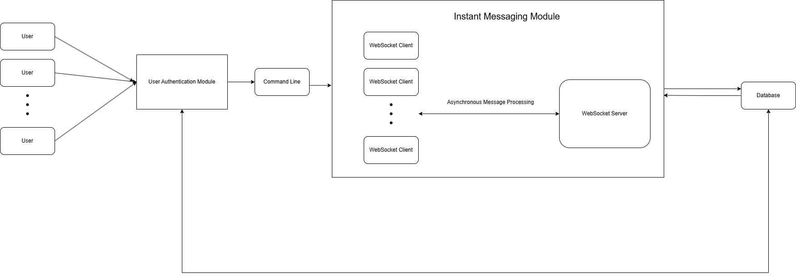

# ECE1724-Rust Project Proposal

## Motivation
Designing the real-time chat application using Rust offers multiple motivations rooted in its performance, safety, and scalability. Rust's high-performance capabilities, comparable to C and C++, allow for efficient handling of numerous concurrent WebSocket connections, a key requirement for real-time communication. Its memory safety model, which eliminates the need for a garbage collector, ensures predictable and smooth performance without pauses, a critical factor in applications where responsiveness is vital. Rust's ownership and borrowing system also guarantees safe concurrency, preventing common issues like race conditions and data corruption, which are essential when managing multiple users and chat rooms. With asynchronous support via the async/await model, Rust allows the backend to scale effectively, handling thousands of concurrent users without blocking the system. The robust ecosystem of libraries like Tokio for async programming and WebSocket crates further simplifies building a high-performance chat application. Additionally, the option to use Yew for the front-end means the entire application can be developed consistently in Rust, making it a full-stack solution. These factors, combined with Rust's strong reliability and safety guarantees, provide a compelling motivation to choose it for building a scalable, real-time chat application focused on raw performance.

## Objective and Key feature
Design and develop a high-performance, scalable real-time chat application that enables users to create rooms and send messages instantly. Key features include basic user authentication, chat room (or channel) creation and joining, and real-time messaging using WebSockets to ensure efficient data transfer. The application will also support presence detection, allowing users to see who is online or offline. A simple front-end user interface, which could be implemented as a command-line utility, will facilitate user interaction with the chat system. The focus will be on optimizing performance and ensuring the application scales effectively with increased usage.

## Tentative plan

### Work Distrubution 

| Tasks      | Worker |
| ----------- | ----------- |
| System Design  | Ze Yang  1010007145|
| User Authentication Module | Yingying Liu  1010007145|
| Instant Messaging  Module   | Yang Hu   1010007145|

### Time Line
| Tasks      | Time |
| ----------- | ----------- |
| System Design  | two weeks  |
| User Authentication Module | Three Weeks |
| Instant Messaging  Module   | Three Weeks |

### System Design

Figure 1 System Overview

The chat application is designed as a distributed system with a client-server architecture, supporting real-time messaging and high scalability. Figure 1 illustrates the main components of the system, highlighting the separation of concerns and modular structure:

1. **Frontend Interface**: Clients connect via a command-line interface (CLI) that interacts with the backend through RESTful APIs for user-related functions (e.g., login, signup) and WebSocket connections for real-time message exchange. Each client maintains a persistent WebSocket connection to ensure immediate message delivery and presence detection.

2. **Instant Messaging Module and User Authentication Module**: This two modules handle all core functionalities, including user authentication, chat room management, and message broadcasting. Authentication requests are managed via RESTful APIs, while messaging leverages WebSockets for low-latency, asynchronous data transfer. Instant Messaging Module is built with asynchronous programming models, allowing the execution of multiple tasks, such as handling concurrent WebSocket connections.

3. **Data Storage**: A MySQL database is used to store user data, chat rooms, and message history. The database schema includes tables for Users, ChatRooms, UserInChatRoom (for membership tracking), and Messages to ensure data integrity and efficient querying.

4. **Scalability and Performance**: Leveraging Rust’s async/await model and the Tokio runtime, the backend can efficiently handle multiple concurrent WebSocket connections. By separating API and WebSocket processing, the system achieves both modularity and high performance. The backend is designed to handle increased load by distributing client connections and load balancing message broadcast requests.

This design ensures that the system can support real-time, scalable, and low-latency messaging for a potentially large user base.

#### API Design

- Tools: Apifox
- Style: RESTful API
  
#### Backend framework: MVC (Model-View-Controller)

The **MVC pattern** is often ideal for web applications like chat apps because it separates concerns, making the code more maintainable and testable:

- **Model**: Represents the data and database interactions. In this chat app, the `Users`, `ChatRooms`, `Messages`, and `UserInChatRoom` entities would reside in the Model layer.

- **View**: Typically handles user interfaces; in this case, it could represent the WebSocket and RESTful APIs for delivering data to the client.

- **Controller**: Acts as an intermediary between the Model and View. The controller processes user inputs, interacts with the Model to fetch or store data, and then sends appropriate responses via the View.

#### Data Model
 **Entities**: 
  - **Users**
  : `user_id` (PK), `username`, `email`, `password_hash`, `status`, `created_at`

- **ChatRooms**
  : `chatroom_id` (PK), `room_name`, `created_by` (FK to `Users.user_id`), `created_at`

- **UserInChatRoom** (Associative Entity)
  : `user_id` (FK to `Users.user_id`), `chatroom_id` (FK to `ChatRooms.chatroom_id`), `joined_at`
  - Composite Key: (`user_id`, `chatroom_id`)

- **Messages**
  : `message_id` (PK), `chatroom_id` (FK to `ChatRooms.chatroom_id`), `sender_id` (FK to `Users.user_id`), `message_text`, `sent_at`

**Relationships**:
   - Users can create multiple ChatRooms (1-to-many relationship).
   - Users can join multiple ChatRooms, and ChatRooms can have multiple Users (many-to-many relationship represented by `UserInChatRoom`).
   - Users can send multiple Messages in ChatRooms (1-to-many relationship).
   - ChatRooms contain multiple Messages (1-to-many relationship).

### User Authentication Module

Our User Authentication Module will manage user sessions by securely verifying and tracking user credentials. This module provides essential authentication features, allowing users to log in and view other users’ statuses in the chatroom they have joined. Users can also log out at any time to end their session. 

#### Basic Requirements

For our Minimal Viable Product (MVP), the User Authentication Module should support the following features:

- User Login：Authenticate users by comparing provided login credentials against stored encrypted data.
- User Logout: Enable users to securely log out, terminating their session and updating their online status.
- Fetch User Online Status: Allow logged-in users to see the online status of other users within the same chatroom.
- User Sign Up: Allow users to create a new account
- Chat Room Management
  - Chat Room Creation: Allow users to create new chatrooms.
  - Joining Chat Room: Enable users to join existing chatrooms.
  - Leaving Chat Room: Allow users to leave any chatroom they have joined.

#### Technical Stack

- `Cryptography`: argon2 algorithm for password hashing.
- `Database`: MySQL for data persistence.
- `Frontend Framework`: A front-end user interface with command-line utility

### Instant Messaging Module

Our instant messaging (IM) module is responsible for communicating raw text messages between the different Clients in a Chat Room. We will use WebSockets to implement the real-time messaging module for our application, which is the standard practice in the industry to provide reliable and low-latency communication.

#### Basic Requirements

##### WebSocket Server

Our instant messaging app primarily deals with input/output operations, so we've designed the server to use asynchronous programming. This allows it to handle multiple user requests efficiently while maintaining fast response times. The Server will be built utilizing WebSocket and asynchronous tasks so that it will:

- Listen on a specified port for incoming connections
- Accept incoming connections from *multiple* Clients concurrently and handle each client in a separate asynchronous task
- Process incoming messages by enchoing them back to the client or broadcasting them to all Clients
- Split the WebSocket stream into a read and write half to handle bidirectional communication efficiently

##### WebSocket Client

Each Client will:

- Connect to the server via a WebSocket.
- Read messages from user inputs and send them to the Server during a live session.
- Receive and parse messages received from the Server and display them to the user.

#### Technical stack

The following technologies might be used in implementing the IM module:

- `Tokio`: An asynchronous runtime for Rust that facilitates concurrent operations and allows for efficient management of numerous connections.
- `Tokio-tungstenite`: A WebSocket library built on top of `Tokio`, allowing for easy integration of WebSockets with asynchronous code.
- `Futures`: A crate used to handle asynchronous streams and sinks, allowing efficient handling of real-time message flow between Clients and the Server.
  